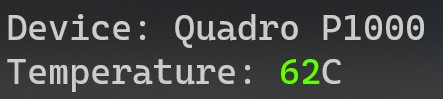

# GpuMonitoring

I often want to know my GPU temperature as I have a laptop that overheats easily so I made this.

The idea is to either view the current temperature from my phone or from the command line 
(as the task manager is slow to launch when my laptop is under stress).

## How Do I Run It?

If you want to launch the website, assuming:

- you have `npx` installed
- you have `serve` installed globally (`npm i serve -g`)
- port `3000` is free

you can run `Run.ps1`. That will spin up a Websocket Rust server and will `npx serve` the webpage.

Alternatively, you can `cargo run` inside the `cli` folder.

  
  

